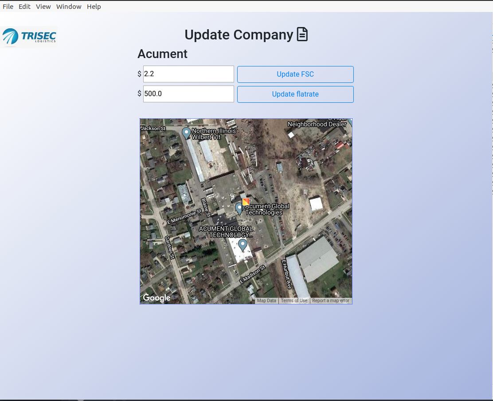
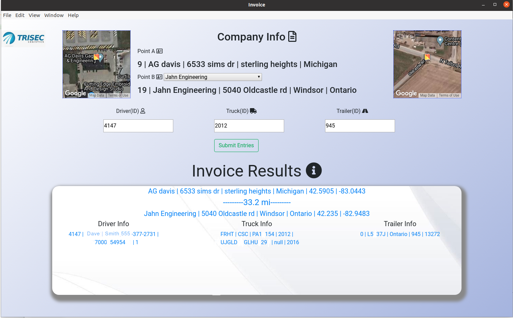

# Trucking - Software
Python Backend\n
Electron Frontend\n
Application to provide user with an accurate way to calculate employee / Delivery drivers pay. With a modern UI.

  

Edit Clientele Fuel service charges and append to database. show company using google maps api with Python.

  

